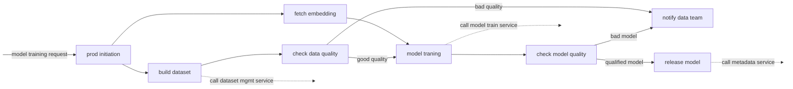
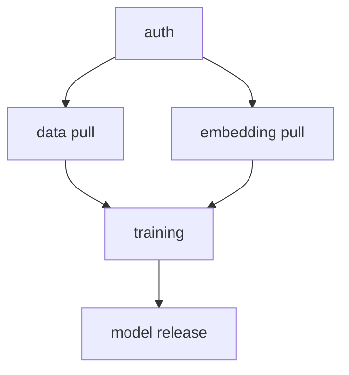
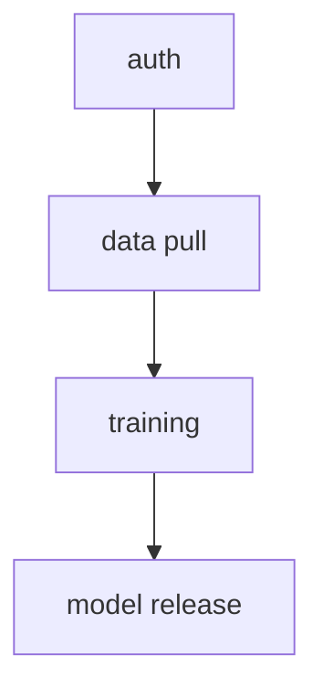
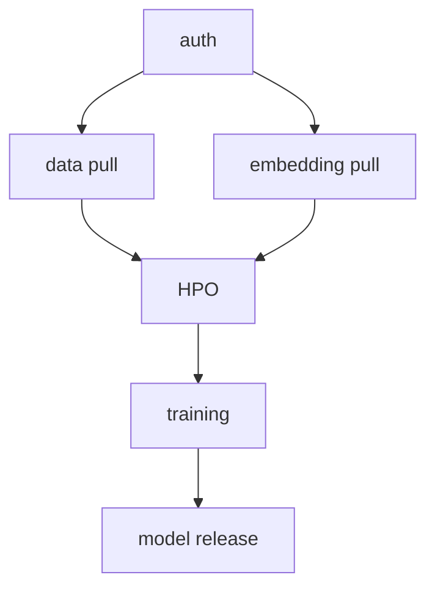
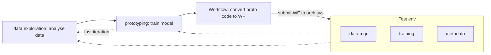

# Workflow Orchestration
## prologue
A service to manage, execute and monitor workflow automation. 
### workflow
sequence of operations that are a part of a larger task. It is a plan consisting of a set of tasks to complete a job.
An example plan can be: fetch raw data, rebuild training dataset, train model, eval the model, and deploy model.

Since workflow is an exec plan, it can be done manually but not ideal. 

We will have numerous workflows, hence need to have a system to handle the complexity of workflow execution: `workflow orchestration`

### workflow orchestration
System built to manage workflow lifecycles: creation, execution, troubleshooting. To manage the automation in DL and schedule code running.

## 9.1.1 workflow
Workflow can be seen as a DAG of steps.

### step:
smallest resumable unit of computation that describes an action. Eg. fetching data, trigger a service, etc. It either succeeds or fails as a whole.

DAG specifies the dependencies among steps and the order to execute them. They do not have a cycle. Starting at the DAG and computing the steps, following the arrows we end up with a trained and released production level model. Eg:

Workflow should not have a loop to guarantee its execution won't fall into a dead loop

## 9.1.2 workflow orchestration
After defining a workflow, next step is to run it, this execution and monitoring is called orchestration
### goal
Automate the execution of tasks defined. *practically* it extens to mean the whole shebang of things: creating, scheduling, executing and monitoring multiple workflows simultaneously in an automated way.
### motivation
My DL work was all in one notebook, why do I need to do this complex stuff?
1. automation
2. work sharing  
Eg:

WF A

WF B

WF C

Since the WFs above are different  but they are split into shareable elemtns, we can be more productive and reduce duplication.

## 9.1.3 Challenges of WFO
It is cumbserome to prototype ideas DL ideas using WFs. Eg:

The first 2 steps are local incubation phase and the rest are production phase.
- local incubation phase: local/dev env and use it for data exploring and prototypin. 
- production phase: convert proto code to WF by breaking into steps and define the DAG, then submit the WF to WFO sys. Then Orch sys takes over and runs the WF on the schedule it has

### gaps betn proto and prod phases
proto and prod pahse aren't directly connected! shipping incubation code to prod isn't straightfwd and this hampers development velocity:
1. WF building and debug aren't easy:
2. WF construction happens not once but frequently:
