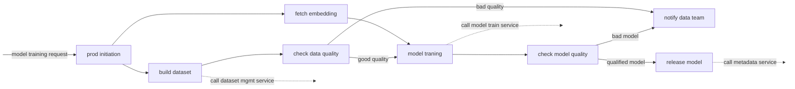
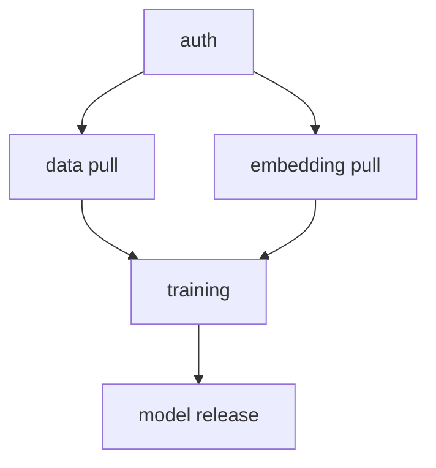
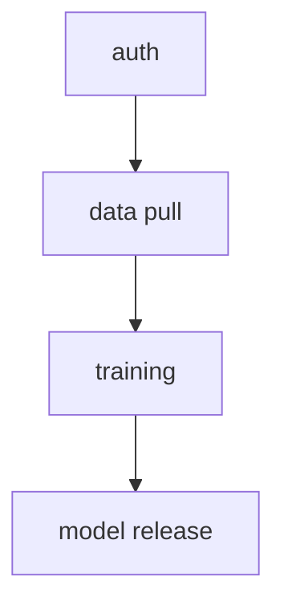
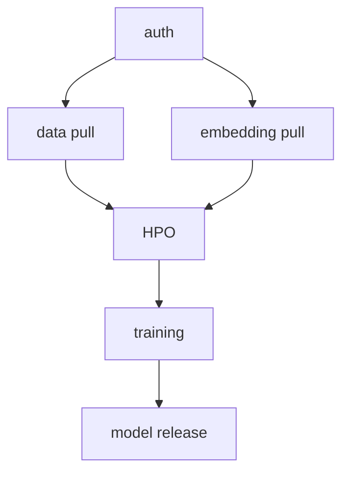
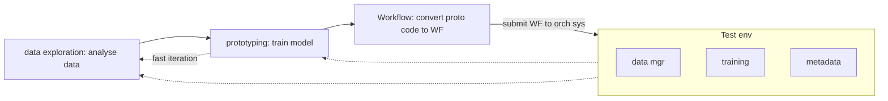

# Workflow Orchestration
## prologue
A service to manage, execute and monitor workflow automation. 
### workflow
sequence of operations that are a part of a larger task. It is a plan consisting of a set of tasks to complete a job.
An example plan can be: fetch raw data, rebuild training dataset, train model, eval the model, and deploy model.

Since workflow is an exec plan, it can be done manually but not ideal. 

We will have numerous workflows, hence need to have a system to handle the complexity of workflow execution: `workflow orchestration`

### workflow orchestration
System built to manage workflow lifecycles: creation, execution, troubleshooting. To manage the automation in DL and schedule code running.

## 9.1.1 workflow
Workflow can be seen as a DAG of steps.

### step:
smallest resumable unit of computation that describes an action. Eg. fetching data, trigger a service, etc. It either succeeds or fails as a whole.

DAG specifies the dependencies among steps and the order to execute them. They do not have a cycle. Starting at the DAG and computing the steps, following the arrows we end up with a trained and released production level model. Eg:

Workflow should not have a loop to guarantee its execution won't fall into a dead loop

## 9.1.2 workflow orchestration
After defining a workflow, next step is to run it, this execution and monitoring is called orchestration
### goal
Automate the execution of tasks defined. *practically* it extens to mean the whole shebang of things: creating, scheduling, executing and monitoring multiple workflows simultaneously in an automated way.
### motivation
My DL work was all in one notebook, why do I need to do this complex stuff?
1. automation
2. work sharing  
Eg:

WF A

WF B

WF C

Since the WFs above are different  but they are split into shareable elemtns, we can be more productive and reduce duplication.

## 9.1.3 Challenges of WFO
It is cumbserome to prototype ideas DL ideas using WFs. Eg:

The first 2 steps are local incubation phase and the rest are production phase.
- local incubation phase: local/dev env and use it for data exploring and prototypin. 
- production phase: convert proto code to WF by breaking into steps and define the DAG, then submit the WF to WFO sys. Then Orch sys takes over and runs the WF on the schedule it has

### gaps betn proto and prod phases
proto and prod pahse aren't directly connected! shipping incubation code to prod isn't straightfwd and this hampers development velocity:
1. WF building and debug aren't easy:
2. WF construction happens not once but frequently:

So the tool for WFO should make the transition from proto code to prod WF seamless with min effort. Eg:
* Metaflow: Can create WF by writing python code with python annotaitons, get workflow from proto code directly w/o any changes, provides unified user experience on model exec betn local and cloud prod envs i.e. friction in WF testing is reduced as MetaFlow operates WFs in the same way for local and prod env.

# 9.2 design a WFO sys
## 9.2.1 User scenarios
Most WF usage can be split in 2 phases:
1. dev
2. exec
### dev phase
Convert train code into a WF:
1. Portotype model training notebook/local env. After local testing and eval, it seems this code can be deployed
2. Use syntax provided by orch sys to rebuild the code into a DAG of tasks in a YAML file. Eg: data parsing -> data augmentation -> dataset building -> training -> [online eval, offline eval] -> model release
3. Set the input/output params and actions for each step in DAG. Eg: for train step, set the step action as a RESTful HTTP request (sends a RESTful request to model train service to start a train job). The payload and params for this RESTful request come from the step input params
4. Once WF is defined, set the WF exec schedule in DAG YAML file. Eg: schedule WF to run on every MOnday and also set it to be triggered by an external event.
5. Run the WF localc validation and submit the WF to Orch service
Pseudo owrkflow
```
# define the WF DAG: body of WF, steps, dependencies
with DAG(
    description = `my sample train WF`,
    schedule_interval = timedelta(months=1),
    start_date = datetime(2025, 1, 1),
) as dag:

# define exec logic for each step
data_parse_step = BashOperator(.. .. ..)
data_aug_step  = BashOperator(.. .. ..) # execs a bash command for data augmentation
dataset_build_step  = BashOperator(.. .. ..)
train_step  = BashOperator(.. .. ..)

# declare steps' dependencies
data_parse_step >> data_aug_step >> dataset_build_step
>> train_step # sequential exec flow
```
### exec phase
orch service execs model training WF:
1. Once WF is submitted, the orch service saves the WF DAG into a database
2. Orch service's scheduler detects the WF and dispatches the tasks fo the WF to backend workers
    - The scheduler component ensures tasks are exec in a sequential manner as def in WF DAG
3. Can use the orch service's UI to check WF's exec progress and results in realtime
4. If WF produces a good model, it can be promoted by engr to the staging and production envs. Else, engr can start another protoype dev.
Critical: How easy it is to convert the proto code to WF, if we don't have to tfm the code to WF each time or have other friction, a lot of time would be saved

WF sgould be computationally light! not do heavy computations, the real work should be done by tasks

## 9.2.3 Orch sys: Genral design


