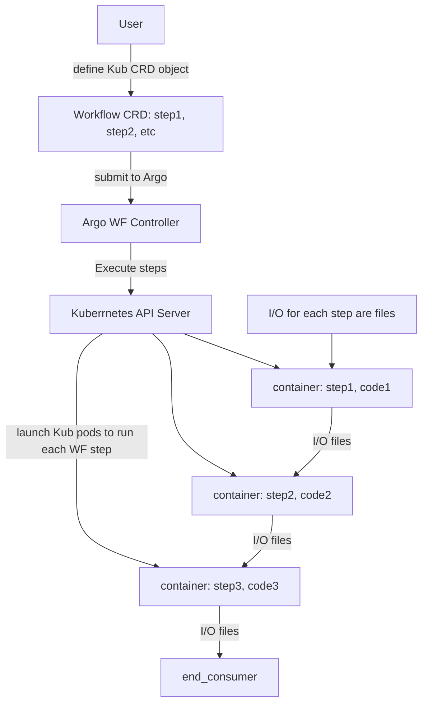

# Workflow Orchestration
## prologue
A service to manage, execute and monitor workflow automation. 
### workflow
sequence of operations that are a part of a larger task. It is a plan consisting of a set of tasks to complete a job.
An example plan can be: fetch raw data, rebuild training dataset, train model, eval the model, and deploy model.

Since workflow is an exec plan, it can be done manually but not ideal. 

We will have numerous workflows, hence need to have a system to handle the complexity of workflow execution: `workflow orchestration`

### workflow orchestration
System built to manage workflow lifecycles: creation, execution, troubleshooting. To manage the automation in DL and schedule code running.

## 9.1.1 workflow
Workflow can be seen as a DAG of steps.

### step:
smallest resumable unit of computation that describes an action. Eg. fetching data, trigger a service, etc. It either succeeds or fails as a whole.

DAG specifies the dependencies among steps and the order to execute them. They do not have a cycle. Starting at the DAG and computing the steps, following the arrows we end up with a trained and released production level model. Eg:

Workflow should not have a loop to guarantee its execution won't fall into a dead loop

## 9.1.2 workflow orchestration
After defining a workflow, next step is to run it, this execution and monitoring is called orchestration
### goal
Automate the execution of tasks defined. *practically* it extens to mean the whole shebang of things: creating, scheduling, executing and monitoring multiple workflows simultaneously in an automated way.
### motivation
My DL work was all in one notebook, why do I need to do this complex stuff?
1. automation
2. work sharing  
Eg:

WF A

WF B

WF C

Since the WFs above are different  but they are split into shareable elemtns, we can be more productive and reduce duplication.

## 9.1.3 Challenges of WFO
It is cumbserome to prototype ideas DL ideas using WFs. Eg:

The first 2 steps are local incubation phase and the rest are production phase.
- local incubation phase: local/dev env and use it for data exploring and prototypin. 
- production phase: convert proto code to WF by breaking into steps and define the DAG, then submit the WF to WFO sys. Then Orch sys takes over and runs the WF on the schedule it has

### gaps betn proto and prod phases
proto and prod pahse aren't directly connected! shipping incubation code to prod isn't straightfwd and this hampers development velocity:
1. WF building and debug aren't easy:
2. WF construction happens not once but frequently:

So the tool for WFO should make the transition from proto code to prod WF seamless with min effort. Eg:
* Metaflow: Can create WF by writing python code with python annotaitons, get workflow from proto code directly w/o any changes, provides unified user experience on model exec betn local and cloud prod envs i.e. friction in WF testing is reduced as MetaFlow operates WFs in the same way for local and prod env.

# 9.2 design a WFO sys
## 9.2.1 User scenarios
Most WF usage can be split in 2 phases:
1. dev
2. exec
### dev phase
Convert train code into a WF:
1. Portotype model training notebook/local env. After local testing and eval, it seems this code can be deployed
2. Use syntax provided by orch sys to rebuild the code into a DAG of tasks in a YAML file. Eg: data parsing -> data augmentation -> dataset building -> training -> [online eval, offline eval] -> model release
3. Set the input/output params and actions for each step in DAG. Eg: for train step, set the step action as a RESTful HTTP request (sends a RESTful request to model train service to start a train job). The payload and params for this RESTful request come from the step input params
4. Once WF is defined, set the WF exec schedule in DAG YAML file. Eg: schedule WF to run on every MOnday and also set it to be triggered by an external event.
5. Run the WF localc validation and submit the WF to Orch service
Pseudo owrkflow
```
# define the WF DAG: body of WF, steps, dependencies
with DAG(
    description = `my sample train WF`,
    schedule_interval = timedelta(months=1),
    start_date = datetime(2025, 1, 1),
) as dag:

# define exec logic for each step
data_parse_step = BashOperator(.. .. ..)
data_aug_step  = BashOperator(.. .. ..) # execs a bash command for data augmentation
dataset_build_step  = BashOperator(.. .. ..)
train_step  = BashOperator(.. .. ..)

# declare steps' dependencies
data_parse_step >> data_aug_step >> dataset_build_step
>> train_step # sequential exec flow
```
### exec phase
orch service execs model training WF:
1. Once WF is submitted, the orch service saves the WF DAG into a database
2. Orch service's scheduler detects the WF and dispatches the tasks fo the WF to backend workers
    - The scheduler component ensures tasks are exec in a sequential manner as def in WF DAG
3. Can use the orch service's UI to check WF's exec progress and results in realtime
4. If WF produces a good model, it can be promoted by engr to the staging and production envs. Else, engr can start another protoype dev.
Critical: How easy it is to convert the proto code to WF, if we don't have to tfm the code to WF each time or have other friction, a lot of time would be saved

WF sgould be computationally light! not do heavy computations, the real work should be done by tasks

## 9.2.3 Orch sys: Genral design
### 5 components
1. web servers: UIs and APIs to create, inspect, trigger and debug behvior of WF
2. scheduler & controller: do 2 things
    - Scheduler watches every active WF in system and schedules WF to run at right time
    - Controller dispatches WF tasks to workers
3. metadata DB: stores WF's config, DAG, editing and exec history and the WF tasks' exec state
4. worker group: provide compute resources to run WF tasks. Abstract away the infra and is agnostic to the running task. Eg:
    - different workers like kubernetes worker, amazon elastic compute cloud (EC2) worker but they can all exec the same task but on different infra
5. object store: shared file storage for all other componenets; usually built on top of cloud object storage like amazon simple storag service (S3). use:
    - task output sharing: worker1 runs task1 and reads output val of the previous task i.e. task0 from the obj store as task1's input, then the worker1 also saves the task1 output to obj store for successor task task2

Obj store and metadata DB are accessible to all compoenents of orch sys. 
*benefit of centralized store* it de-couples core components so the web server, scheduler, and workes can work independently.

### How is WF exec?
1. define DAG for WF:
    - set of tasks
    - control flow of task exec sequence
    - for each task
        - use either systems default operator like shell or python
        - or build own operator to exec the task
2. submit the WF: DAG + dependent code to `web server` via UI or CLI.
    - WF saved in `metadata DB`
3. `scheduler` periodically scans the metadata DB & detects new WF
    - kicks off the WF at the scheduled time
    - by callin `controller` to
        - dispatch WF's tasks to worker queue (based on task seq in DAG)
4. a `worker` picks up a task from the sahred job queue
    - reads task definition from `metadata DB`
    - execs task by running the task operator
    - saves task output value to `obj store`
    - reports task exec status back to `metadata DB`
Meanwhile the engr can use the UI hosted on `web server` to monitor WF exec. Since both, the scheduler/controller and the workers report the status to `metadata DB` in realtime.

## 9.2.3 WFO design princiles
1. criticality
2. usability
3. extensibility
4. isolation
5. scaling
### 1. criticality
a valid WF should should always be exec correctly, repeatedly and on schedule
### 2. usability 
Should enchance productivity of the DS: their interactions would be WF creation, testing and monitoring. So it should be user frinedly to allow them to do this easily
### 3. extensibility
Need to cater to a variety of DL infra. So it should abstract away whether I'm using EC2 or Kubernetes and end use shouldn't worry about where thier operators or tasks are deployed to
### 4. isolation
2 types:
- crreation isolation
    - if I create a wrong DAG or relase a new version of a lib/module that is used in other WFs, they shouldn't be affected
- execution isolation
    - each WF runs in isolated env: 
        - no resource competition
        - failure of WF A shan't affect WF B
### 5. Scaling
Addresses 2 scaling porblems:
- Many concurrent WFs
    - adding more wotkers to the worker group can handle more concurrent WFs. Given enough resources, it should handle infinit WFs
    - Always keep the SLA (service level agreemeent) for each WF eg: WF A is executed no less than 2 sec after its scheduled time 
- Larg, expansive WFs
    - User shan't worry about performance (so can focus on readable, easy code, easy operations)
    - When the WF exec hits a bottleneck like training ops taking too long, etc, then the Orch sys should be able to  provide horizontal resources like parallelism, distributed training to fix the single WF performance issue
### 6. human centric
Resapect that DL is iterative, ongoing work from proto to prod. So, make effort to help ease the conversion from proto to prod as semalessy as can

## 9.3 Open source WFOs
3 opensource: Airflow, Argo, Metaflow. To do some comparison, implement the same WF in all three: New Data -> Tfm data -> save to new table in DB -> notify the DS. The WF should run daily.
## 9.3.1 Airflow
Created at AirBnB in 2014. Now part of Apache. The most adopted Orch Sys.
- Write code to author, schedule and monitor WFs
- Not designed for DL. Orignally designed for complex ETL pipelines
- But still used in DL because:
    - extensible
    - prod quality
    - GUI support
### Build WF for Typical use case
2 steps:
- Define WF DAG and tasks
- Declare task dependencies in DAG

The DAG is python code
```python
# declare WF DAG
with DAG(dag_id="dp_dag",
        schedule_interval="@daily,
        deafult_args=default_args,
        template_searchpath= [f"{os.envrion['AIRFLOW_HOME']}"],
        catchup=False
        ) as dag:
    # define tasks of WF, below: each code section is a task
    # check if new files arrived
    is_new_data_ready = FileSensor(
        task_id="is_new_data_ready",
        fs_conn_id="data_path",
        filepath="data.csv",
        ...
    )
    # define data tf task
    # the actual logi implemented in tf_data function
    tfm_data = Pythonoperator(
        task_id="tfm_data",
        python_callable=tf_data
    )
    # def table creation task
    # PostgresOperator is predefined airflow operator to interact with Postgres DB
    make_table = PostgresOperator(
        task_id="make_table",
        sql='''CREATE TABLE IF NOT EXISTS invoices (
                .. .. ..
                );''',
        postgres_conn_id='postgres',
        database='customed_data'
    )
    # def savin task
    save_db = PythonOperator(
        task_id='save_db',
        python_callable=store_in_db
    )
    # def notification task
    notify_ds = SlackWebhookOperator(
        task_id='notify_ds',
        http_conn_id='slcak_conn',
        webhook_token=slack_token,
        message="DS notification\n"
        ...
    )
# Declare Task dependencies
is_new_data_ready >> tfm_data
tfm_data >> make_table >> save_db
save_db >> notify_ds
save_db >> make_report

# The actual Data TFM logic, etc that is ref in tasks
def tf_data(*args, **kwargs):
    ...

def store_in_db(*args, **kwargs):
    ...
```
- Each task is implemented as an operator
    - Many predefined: MySQLOperator, SimpleHttpOperator, Docker, etc
    - They help implement task w/o coding
    - Can use `PytohnOperator` to implement custom func
- After def DAG and code deployment on Airflow
- Use UI or CLI to check the WF exec status
    ```bash
    # print all active DAGs
    $ airflow dags list
    # Print task list in a particular dag like data_process_dag
    $ airflow tasks list data_process_dag
    # Print heirarchy of tasks in a particular DAg like data_process_dag
    $ airflow tasks list data_process_dag --tree
    ```
### Features
- DAGs (implemented via python lib)
- Programmatic WF mgmt
    - Create tasks on the fly
    - make complex dynamic WFs
- Many built-in Operators to reduce coding
- Solid task dependency and execution mgmt
    - Auto-rety policy built-in every task
    - Provides diff sensor types to handle runtime dependencies like:
        - detect task completion
        - detect WF run status change
        - check file presence
- Extensibility
    - Sensors, hooks, operators are fully extensible
    - Can add cutom operators to itnegrate to diff sys
- Monitoring and mgmt interface
    - Powerful UI get quick overview of WF/task exec status and history
    - User can clear/trigger tasaks/WFs from the UI
- Prod quality
    - Many tools ot maintain service in production env
        - task log serching
        - scaling
        - alerting
        - RESTful APIs
### Limits
- Steep leraning curve
    - Need to implement tasks, operators not supported by built-in operators
- No easy was to do local tasting of WF
- Hard to move DL code from proto to prod
    - extra work to convert local model to DAG
    - cant directly go from model code to build WF DAG
- Hi complexity to operate in Kubernetes
    - Not straightforward to deploy and operate Airflow there
    - Argo WF is better choice for an Orch Sys to run on here

## 9.3.2 Argo WFs
Opensource, container-native on Kubernetes.
- WFs and tasks here are implemented as Kub custom resource definition objects (CRD)
- Each task/step is exec as a Kub pod

Steps:
1. Def WF and its steps/tasks as a CRD obj: usually a YAML file
2. Submit WF to Argo
    - Its Ctrler creates CRD objs inside the Kub cluster
3. Kub pods are launched dynamically to run WF in its WF sequence

Each step's exec is completely isolated by contianer and pod. Each step only uses files to communicte I/) vals to the next step. Argo `magically` mounts the dependent file int the step container

### advantage
1. The task isolation is great one
2. Simplicity: If u know Kub, then install/troubleshoot is easy here
    - can use atiher Argo cmds or Kub cmds to debug

### Build WF for typical use case
Same task as before: check new data -> tf data -> save to DB -> notify DS
```YAML
apiVersion: argoproj.io/v1alpha1
kind: Workflow # The CRD obj is WF
metadata:
    generateName: data-processing-
spec:
    entrypoint: argo-steps-workflow-example
    templates:
        - name: argo-steps-workflow-example
        Steps: # Declre WF steps
            - - name: check-new-data
                template: data-checker # the body is def as another tmeplate, similar to a func
            - - name: transform-data
                template: data-converter
                arguments:
                    artifacts:
                        - name: data-paths # data-paths artifact is from the data-apths artifacts generated by the check-new-data step
                          from: "{{steps.check-new-data.outputs.artifacts.new-data-paths}}" # this is how steps pass params
            - - name: save-into_db
                template: postgres-operator
            - - name: notify-ds
                template: slack-messenger
        
        - name: data-checker # actual setp definition, similar to function implementation/def
          container:
            image: docker/data-checker:latest
            command: [scan, /datastore/ds/]
          outputs:
            artifacts:
                - name: new-data-paths # declares output artifact: generates new-data-paths at this step; ther artifact is from /tmp/data_paths.txt which could also be a directory
                  path: /tmp/data_paths.txt
        
        - name: data-converter
          inputs:
            artifacts:
                - name: data_paths # unpacks data_pths input artifact and puts it at oath below: /tmp/raw ....
                  path: /tmp/raw_data/data_paths.txt
          container:
            image: docker/data-checker:latest
            command: [data_converter, /tmp/raw_data/data_paths.txt]

        - name: save-into-db
        ...
        - name: notify-ds
        ...
```

