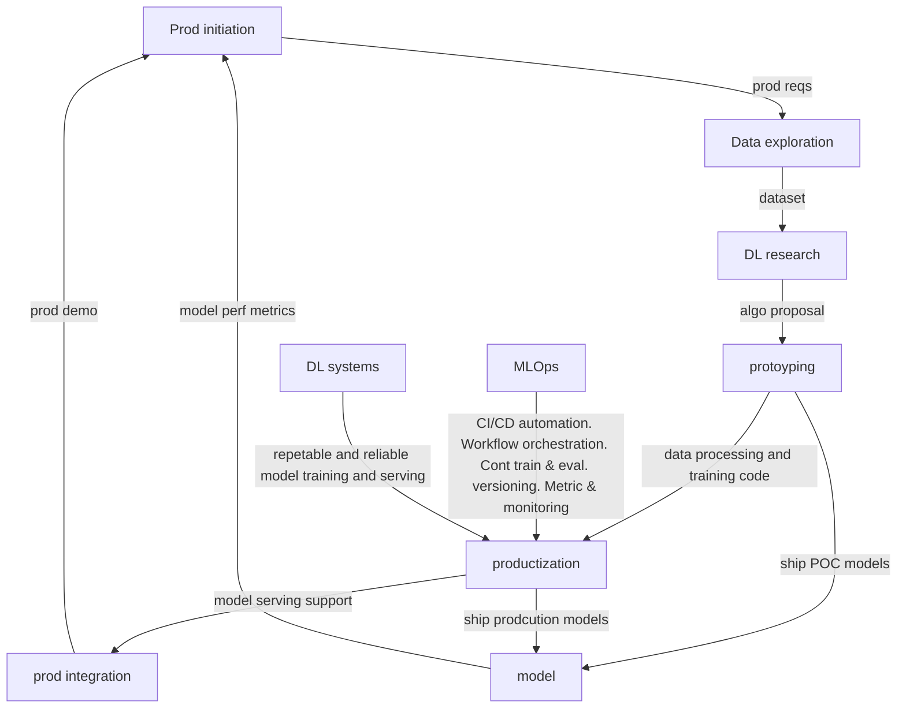
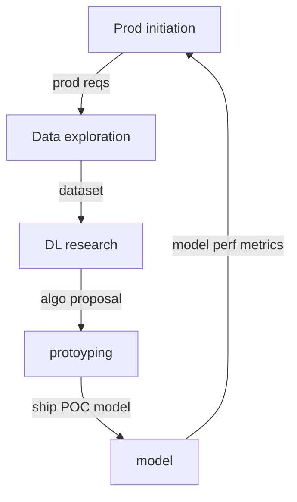
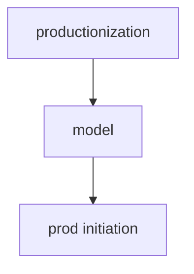

# phases in deep learning prod dev cycle


## 1: Prod init
PM or Proj owner ID a problem that can be addressed with ML
## 2: Data exploration
Data scientists work with data engineers to collect as much data as possible, label it, and build datasets.
1. Unstructurred and can be done casually
2. Can be:
    - python script
    - shell script
    - manual copy of data
3. To analyse Data. Can use:
    - Jupyter notebook
    - SageMaker Data wrangler
    - Databricks

* No formal data collection pipeline is needed to be built
* The more relavent the data, the higher is chance of building affective and efficient models

## 3 & 4: Research and prototyping
### Goal: Most feasible algo to address requirements
* Data scientists work with AI researchers to propose and evaluate different training algo with datasets got from prev data exploration phase
    * pilot multiple ideas and build POC models to eval them
* Accuracy of algo is not the only thing considered. Need to consider:
    * compute req
    * data volume
    * algo implementaion cost
### Inner loop

Purpose: Get prod feeedback in early phase
- May run thru the loop multiple times until consensus reached on algo and the data to be used to address the req

Vet the approach with the prod team preventing the expensive and demoralizing process of reworking in later stages

## 5: Productizing AKA MLOps
Server consumer requests. Withstand request load. Handle adverse conditions like malformed input. Postproduction effort:
- continuous model metric monitoring and eval
- feedback gathering
- model retraining

TODO list:
1. Build data pipeline:
    1. pull data from different source repeatedly
    2. keep dataset versioned and updated
    3. preprocess dataset. Eg:
        1. data enhancement/enrichment
        2. integrating with labeling tools
2. Refactor and dockerize prototyping code to production-quality model taining code
3. Versioning inputs and outputs (make result of training and model serving reproducible). Eg:
    1. Training code to report training metadata (training date, time, duration, hyperparams)
    2. Model metadata (perf metrics, data used, code used)
4. Setup CI (jenkins, gitlab) and CD. automates: code building, validation, deployment.
5. Build continuous model training and eval pipeline: consume new dataset nad produce models in repeatable manner
6. Build model deployment pipeline to release models that pass quality gates, to be accessed by model serving.
    - async or real-time model prediction can be done depnding on req. 
    - model serving hosts model and exposes it via API
7. Build continuous monitoring pipelines to periodically assess:
    - dataset: feature drift
    - model: perf degradation (concept drift)
    - serving perf

### MLOps
```
- Monitoring
    - prediction accuracy
    - retraining performance
    - impact assesment
    - fallback/failure rate
    - logging
- artifact mgmt
    - artifact repos
    - registration
    - QA sim tests
    - UAT
- Env config
    - Dev, QA, prod
    - Infra mgmt
    - Plat mgmt
    - dependency libs mgmt
- Code review
    - peer review
    - unit test cover
    - metrics validation
- Code development
    - Git
    - branch strategy
    - feature merging
    - params & metrics tracking
    - project experimentation and tuning tracking
- Release
    - versioning + registration
    - change mgmt
    - approvals
    - auditing
    - A/B test + statistical eval
    - Bandit algo
```
Hurdles to shipping model to production:
- massive infra (tools, services, servers)
- heavy cross-team collab (data scientists need to work with data engr, plat devs, devops engr, ml engr)

Another loop:

This is the second vetting with prod team before integrating modell with app.
- Compares model and data between prototype and production
- Ensure model perf and scalability (eg serving capcity) match the req

Ref:
- [Operationalizing Machine Learning](https://arxiv.org/pdf/2209.09125)
- [Machine Learning Operations](https://arxiv.org/pdf/2205.02302)

## 6: App integration
Integrate model to the application:
- host model in a serving serviceand change the app logic to send model prediction requestes using the service
- evalute metrics important to app like: clickthru rate, churn rate i.e prod metric evaluation (not ML-specific metrics like good precision-recall)

