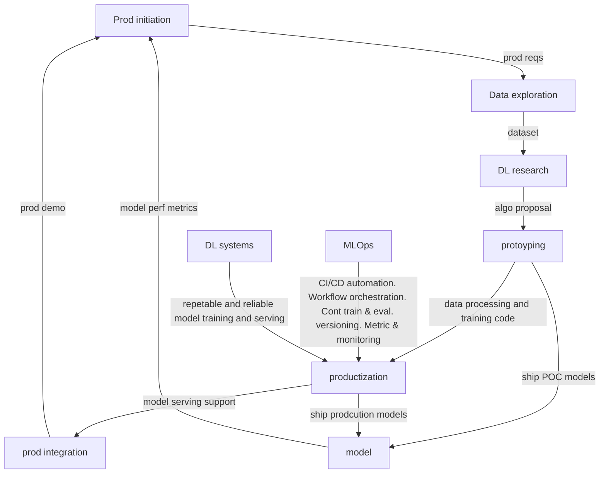
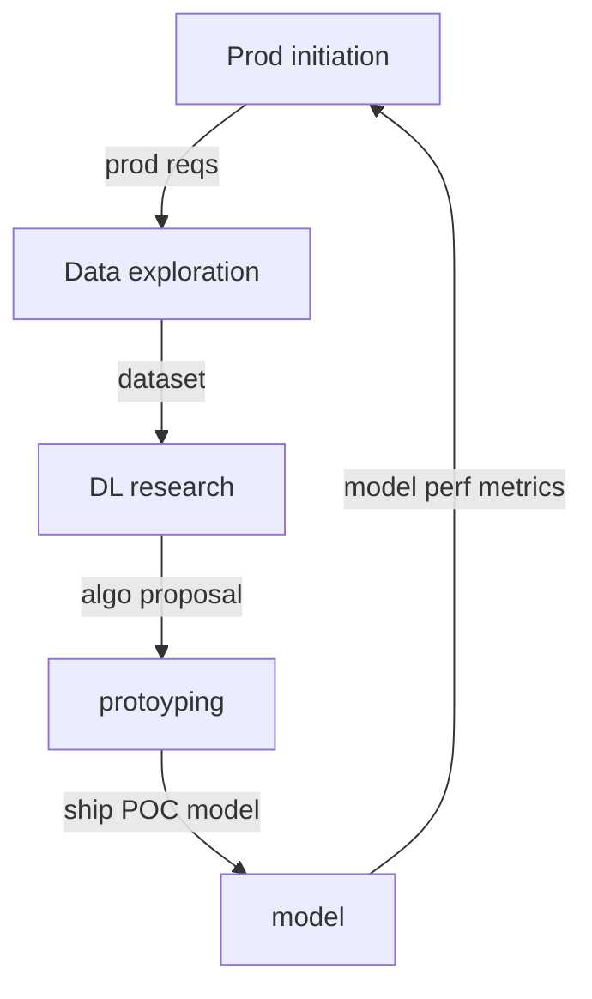

# phases in deep learning prod dev cycle

## 1 Prod init
PM or Proj owner ID a problem that can be addressed with ML
## 2 Data exploration
Data scientists work with data engineers to collect as much data as possible, label it, and build datasets.
1. Unstructurred and can be done casually
2. Can be:
    - python script
    - shell script
    - manual copy of data
3. To analyse Data. Can use:
    - Jupyter notebook
    - SageMaker Data wrangler
    - Databricks

* No formal data collection pipeline is needed to be built
* The more relavent the data, the higher is chance of building affective and efficient models

## 3 & 4: Research and prototyping
### Goal: Most feasible algo to address requirements
* Data scientists work with AI researchers to propose and evaluate different training algo with datasets got from prev data exploration phase
    * pilot multiple ideas and build POC models to eval them
* Accuracy of algo is not the only thing considered. Need to consider:
    * compute req
    * data volume
    * algo implementaion cost
### Inner loop

Purpose: Get prod feeedback in early phase
- May run thru the loop multiple times until consensus reached on algo and the data to be used to address the req

Vet the approach with the prod team preventing the expensive and demoralizing process of reworking in later stages

## 5 Productizing AKA MLOps

